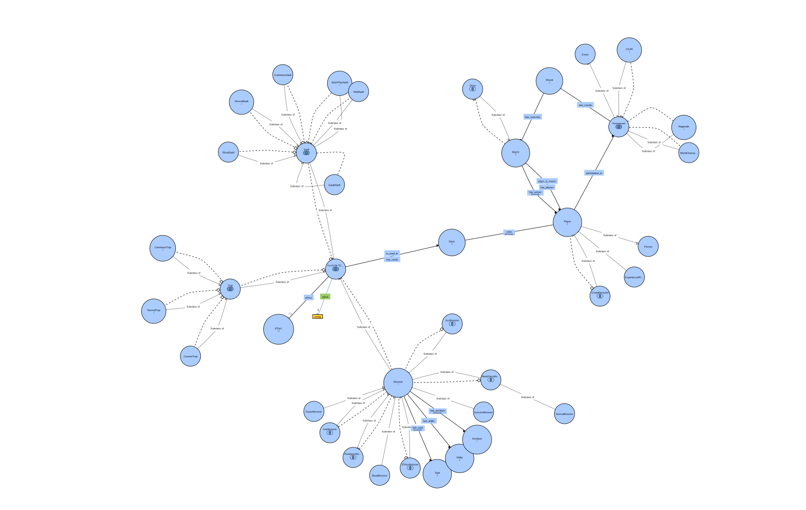

# Yu-Gi-Oh TCG ontology project for 'Knowledge Representation and Reasoning' class
Author: Ivan Arabadzhiyski
# About
Final course project for the 'Knowledge Representation and Reasoning' class for Information Retrieval Masters at Sofia University, Faculty of Mathematics and Informatics.
# Introduction
In this project we create and query an ontology describing Yu-Gi-Oh TCG cards and tournaments, all of the matches, palyers participating and decks they are using. The main classes we are looking at are the Card, Player and Tournament. Card is the most complicated one. Each card in the game of Yu-Gi-Oh can be either Monster, Spell or Trap. Each of those have their own subtypes. Monsters can be categorize by many criteria, but we'll focus on their card type. Monsters can be NormalMonsters, EffectMonster, RitualMonsters, SynchroMonsters, XyzMonsters, LinkMonsters and PendulumMonsters. Each card has an effect. Monsters with effects are obviously EffectMonsters, monsters without one are NormalMonsters and monsters with 2 effects are PendulumMonsters. Also LinkMonsters have link rating instead of defense, xyz monsters have rank instead of levels. This way we infer the monster type later on. We also have Players contesting in Tournaments. They play in matches. Each win is worth 3 points and each draw is worth 1 point. Tournament and Person are some basic classes right now but they probably should become external classes later on.

# Built Using
- [Python3](https://www.python.org/) - Programming Language
- [Owlready2](https://pypi.org/project/Owlready2/) - A package for ontology-oriented programming in Python: load OWL 2.0 ontologies as Python objects, modify them, save them, and perform reasoning via HermiT. Includes an optimized RDF quadstore. 

[Documentation](https://owlready2.readthedocs.io/en/latest/index.html) | [Project Repository](https://bitbucket.org/jibalamy/owlready2/src/master/)

# Requirements
Only python3 and Owlready2 are needed for running the application.

```python
pip install -r requirements.txt
```

# Run
```bash
python yugiOntology.py
```
Creates `yugiOntology.owl` and `yugiOntologyInferred.owl` in the directory it's ran.

# Usage
The execution of the program follows these steps

1. Creation
2. Inconsistencies
3. Reasoning
4. Querying

## Ontology Classes

### Class: yugiOntology.Card
	altLabel = ['Yu-Gi-Oh TCG card']
	comment = ['There are three main types of cards: Monster , Spell, Trap']
	equivalent_to = [yugiOntology.Monster | yugiOntology.Spell | yugiOntology.Trap, yugiOntology.name.some(<class 'str'>)]
	is_a = [owl.Thing]
	Subclasses:
		- yugiOntology.Monster
		- yugiOntology.Spell
		- yugiOntology.Trap
	Individuals:
		- yugiOntology.SkyStrikerAce-Raye
		- yugiOntology.AshBlossom&JoyousSpring
		- yugiOntology.Odd-EyesRagingDragon
		- yugiOntology.Number39:Utopia
		- yugiOntology.Odd-EyesPendulumDragon
		- yugiOntology.DarkMagician
		- yugiOntology.CrystronHalqifibrax
		- yugiOntology.PotOfGreed
		- yugiOntology.SkyStrikerMecha-WidowAnchor
		- yugiOntology.continioustrap1
		- yugiOntology.continioustrap2
		- yugiOntology.normaltrap1

### Class: yugiOntology.Monster
	is_a = [yugiOntology.Card, yugiOntology.effect.max(2, owl.Thing)]
	Subclasses:
		- yugiOntology.NonEffectMonster
		- yugiOntology.XyzMonster
		- yugiOntology.LinkMonster
		- yugiOntology.EffectMonster
		- yugiOntology.PendulumMonster
		- yugiOntology.FusionMonster
		- yugiOntology.SynchroMonster
		- yugiOntology.RitualMonster
	Individuals:
		- yugiOntology.SkyStrikerAce-Raye
		- yugiOntology.AshBlossom&JoyousSpring
		- yugiOntology.Odd-EyesRagingDragon
		- yugiOntology.Number39:Utopia
		- yugiOntology.Odd-EyesPendulumDragon
		- yugiOntology.DarkMagician
		- yugiOntology.CrystronHalqifibrax

### Class: yugiOntology.Spell
	equivalent_to = [yugiOntology.ContiniousSpell | yugiOntology.NormalSpell | yugiOntology.EquipSpell | yugiOntology.QuickPlaySpell | yugiOntology.RitualSpell | yugiOntology.FieldSpell]
	is_a = [yugiOntology.Card, yugiOntology.effect.max(1, owl.Thing)]
	Subclasses:
		- yugiOntology.ContiniousSpell
		- yugiOntology.NormalSpell
		- yugiOntology.EquipSpell
		- yugiOntology.QuickPlaySpell
		- yugiOntology.RitualSpell
		- yugiOntology.FieldSpell
	Individuals:
		- yugiOntology.PotOfGreed
		- yugiOntology.SkyStrikerMecha-WidowAnchor
### Class: yugiOntology.Trap
	equivalent_to = [yugiOntology.CounterTrap | yugiOntology.NormalTrap | yugiOntology.ContiniousTrap]
	is_a = [yugiOntology.Card, yugiOntology.effect.max(1, owl.Thing)]
	Subclasses:
		- yugiOntology.ContiniousTrap
		- yugiOntology.NormalTrap
		- yugiOntology.CounterTrap
	Individuals:
		- yugiOntology.continioustrap1
		- yugiOntology.continioustrap2
		- yugiOntology.normaltrap1
### Class: yugiOntology.Effect
	is_a = [owl.Thing]
	Subclasses:
	Individuals:
		- yugiOntology.effect1
		- yugiOntology.effect2
		- yugiOntology.effect3
		- yugiOntology.effect4
		- yugiOntology.effect5
		- yugiOntology.effect6
		- yugiOntology.effect7
		- yugiOntology.effect8
		- yugiOntology.effect9
		- yugiOntology.effect10
### Class: yugiOntology.NonEffectMonster
	equivalent_to = [yugiOntology.Monster & Not(yugiOntology.effect.some(yugiOntology.Effect))]
	is_a = [yugiOntology.Monster]
	Subclasses:
		- yugiOntology.NormalMonster
	Individuals:
### Class: yugiOntology.XyzMonster
	equivalent_to = [yugiOntology.Monster & yugiOntology.rank.some(<class 'int'>)]
	is_a = [yugiOntology.Monster, yugiOntology.level.exactly(0, owl.Thing)]
	Subclasses:
	Individuals:
### Class: yugiOntology.LinkMonster
	equivalent_to = [yugiOntology.Monster & yugiOntology.link_rating.some(<class 'int'>)]
	is_a = [yugiOntology.Monster, yugiOntology.level.exactly(0, owl.Thing), yugiOntology.defense.exactly(0, owl.Thing)]
	Subclasses:
	Individuals:
### Class: yugiOntology.EffectMonster
	equivalent_to = [yugiOntology.Monster & yugiOntology.effect.exactly(1, yugiOntology.Effect)]
	is_a = [yugiOntology.Monster]
	Subclasses:
	Individuals:
### Class: yugiOntology.PendulumMonster
	equivalent_to = [yugiOntology.Monster & yugiOntology.effect.min(2, yugiOntology.Effect)]
	is_a = [yugiOntology.Monster]
	Subclasses:
	Individuals:
### Class: yugiOntology.FusionMonster
	is_a = [yugiOntology.Monster]
	Subclasses:
	Individuals:
### Class: yugiOntology.SynchroMonster
	is_a = [yugiOntology.Monster]
	Subclasses:
	Individuals:
### Class: yugiOntology.RitualMonster
	is_a = [yugiOntology.Monster]
	Subclasses:
	Individuals:
### Class: yugiOntology.NormalMonster
	is_a = [yugiOntology.NonEffectMonster]
	Subclasses:
	Individuals:
### Class: yugiOntology.Type
	equivalent_to = [OneOf([yugiOntology.Dragon, yugiOntology.Fairy, yugiOntology.Machine, yugiOntology.Warrior, yugiOntology.Spellcaster])]
	is_a = [owl.Thing]
	Subclasses:
	Individuals:
		- yugiOntology.Dragon
		- yugiOntology.Fairy
		- yugiOntology.Machine
		- yugiOntology.Warrior
		- yugiOntology.Spellcaster
		- yugiOntology.Zombie
### Class: yugiOntology.Ability
	equivalent_to = [OneOf([yugiOntology.Union, yugiOntology.Tuner, yugiOntology.Spirit, yugiOntology.Toon, yugiOntology.Gemini, yugiOntology.Flip])]
	is_a = [owl.Thing]
	Subclasses:
	Individuals:
		- yugiOntology.Union
		- yugiOntology.Tuner
		- yugiOntology.Spirit
		- yugiOntology.Toon
		- yugiOntology.Gemini
		- yugiOntology.Flip
### Class: yugiOntology.Attribute
	equivalent_to = [OneOf([yugiOntology.Dark, yugiOntology.Light, yugiOntology.Divine, yugiOntology.Earth, yugiOntology.Fire, yugiOntology.Water, yugiOntology.Wind])]
	is_a = [owl.Thing]
	Subclasses:
	Individuals:
		- yugiOntology.Dark
		- yugiOntology.Light
		- yugiOntology.Divine
		- yugiOntology.Earth
		- yugiOntology.Fire
		- yugiOntology.Water
		- yugiOntology.Wind
### Class: yugiOntology.ContiniousSpell
	is_a = [yugiOntology.Spell]
	Subclasses:
	Individuals:
### Class: yugiOntology.NormalSpell
	is_a = [yugiOntology.Spell]
	Subclasses:
	Individuals:
		- yugiOntology.PotOfGreed
### Class: yugiOntology.EquipSpell
	is_a = [yugiOntology.Spell]
	Subclasses:
	Individuals:
### Class: yugiOntology.QuickPlaySpell
	is_a = [yugiOntology.Spell]
	Subclasses:
	Individuals:
		- yugiOntology.SkyStrikerMecha-WidowAnchor
### Class: yugiOntology.RitualSpell
	is_a = [yugiOntology.Spell]
	Subclasses:
	Individuals:
### Class: yugiOntology.FieldSpell
	is_a = [yugiOntology.Spell]
	Subclasses:
	Individuals:
### Class: yugiOntology.ContiniousTrap
	is_a = [yugiOntology.Trap]
	Subclasses:
	Individuals:
		- yugiOntology.continioustrap1
		- yugiOntology.continioustrap2
### Class: yugiOntology.NormalTrap
	is_a = [yugiOntology.Trap]
	Subclasses:
	Individuals:
		- yugiOntology.normaltrap1
### Class: yugiOntology.CounterTrap
	is_a = [yugiOntology.Trap]
	Subclasses:
	Individuals:
### Class: yugiOntology.Deck
	is_a = [owl.Thing]
	Subclasses:
	Individuals:
		- yugiOntology.SkyStriker
		- yugiOntology.Odd-Eyes
		- yugiOntology.Eldlich
### Class: yugiOntology.Person
	is_a = [owl.Thing]
	Subclasses:
		- yugiOntology.Player
	Individuals:
		- yugiOntology.Ivan
		- yugiOntology.Kostadin
		- yugiOntology.Ventseslav
		- yugiOntology.Ivaylo
		- yugiOntology.Pesho
		- yugiOntology.Gosho
### Class: yugiOntology.Player
	is_a = [yugiOntology.Person]
	Subclasses:
		- yugiOntology.CrowdFavourite
		- yugiOntology.ExperiencedPlayer
	Individuals:
		- yugiOntology.Ivan
		- yugiOntology.Kostadin
		- yugiOntology.Ventseslav
		- yugiOntology.Ivaylo
		- yugiOntology.Pesho
		- yugiOntology.Gosho
### Class: yugiOntology.Match
	is_a = [owl.Thing, yugiOntology.has_players.exactly(2, yugiOntology.Player)]
	Subclasses:
	Individuals:
		- yugiOntology.match1
		- yugiOntology.match2
		- yugiOntology.match3
		- yugiOntology.match4
		- yugiOntology.match5
### Class: yugiOntology.Round
	is_a = [owl.Thing]
	Subclasses:
	Individuals:
		- yugiOntology.round1
		- yugiOntology.round2
		- yugiOntology.round3
### Class: yugiOntology.Event
	is_a = [owl.Thing]
	Subclasses:
		- yugiOntology.Tournament
	Individuals:
		- yugiOntology.PlovdivLocals06.02.2022
		- yugiOntology.SofiaRegionals30.11.2022
### Class: yugiOntology.Tournament
	equivalent_to = [yugiOntology.Locals | yugiOntology.Regionals | yugiOntology.WorldChampionshipQualifier]
	is_a = [yugiOntology.Event]
	Subclasses:
		- yugiOntology.Locals
		- yugiOntology.Regionals
		- yugiOntology.WorldChampionshipQualifier
	Individuals:
		- yugiOntology.PlovdivLocals06.02.2022
		- yugiOntology.SofiaRegionals30.11.2022
### Class: yugiOntology.Locals
	is_a = [yugiOntology.Tournament]
	Subclasses:
	Individuals:
		- yugiOntology.PlovdivLocals06.02.2022
### Class: yugiOntology.Regionals
	is_a = [yugiOntology.Tournament]
	Subclasses:
	Individuals:
		- yugiOntology.SofiaRegionals30.11.2022
### Class: yugiOntology.WorldChampionshipQualifier
	is_a = [yugiOntology.Tournament]
	Subclasses:
	Individuals:
### Class: yugiOntology.CrowdFavourite
	equivalent_to = [yugiOntology.Player & yugiOntology.years_experience.only(ConstrainedDatatype(float, min_exclusive = 5))]
	is_a = [yugiOntology.Player]
	Subclasses:
	Individuals:
### Class: yugiOntology.ExperiencedPlayer
	is_a = [yugiOntology.Player, yugiOntology.years_experience.only(ConstrainedDatatype(float, min_exclusive = 7))]
	Subclasses:
	Individuals:

## ONTOLOGY DISJOINTNESS:
```
Disjoint classes: AllDisjoint([yugiOntology.Locals, yugiOntology.Regionals, yugiOntology.WorldChampionshipQualifier])
Disjoint classes: AllDisjoint([yugiOntology.CounterTrap, yugiOntology.NormalTrap, yugiOntology.ContiniousTrap])
Disjoint classes: AllDisjoint([yugiOntology.ContiniousSpell, yugiOntology.NormalSpell, yugiOntology.EquipSpell, yugiOntology.QuickPlaySpell, yugiOntology.RitualSpell, yugiOntology.FieldSpell])
Disjoint classes: AllDisjoint([yugiOntology.Monster, yugiOntology.Spell, yugiOntology.Trap])
Different individuals: AllDisjoint([yugiOntology.effect7, yugiOntology.effect8, yugiOntology.effect9, yugiOntology.effect10])
```
## ONTOLOGY OBJECT PROPERTIES:

### Object Property: yugiOntology.effect
	Domain: [yugiOntology.Card]
	Range: [yugiOntology.Effect]
	Instances:
		- (yugiOntology.SkyStrikerAce-Raye, yugiOntology.effect1)
		- (yugiOntology.SkyStrikerMecha-WidowAnchor, yugiOntology.effect2)
		- (yugiOntology.AshBlossom&JoyousSpring, yugiOntology.effect3)
		- (yugiOntology.Odd-EyesRagingDragon, yugiOntology.effect4)
		- (yugiOntology.Odd-EyesRagingDragon, yugiOntology.effect5)
		- (yugiOntology.PotOfGreed, yugiOntology.effect6)
		- (yugiOntology.Number39:Utopia, yugiOntology.effect7)
		- (yugiOntology.Odd-EyesPendulumDragon, yugiOntology.effect9)
		- (yugiOntology.Odd-EyesPendulumDragon, yugiOntology.effect8)
		- (yugiOntology.CrystronHalqifibrax, yugiOntology.effect10)
### Object Property: yugiOntology.has_type
	Domain: [yugiOntology.Monster]
	Range: [yugiOntology.Type]
	Instances:
		- (yugiOntology.SkyStrikerAce-Raye, yugiOntology.Warrior)
		- (yugiOntology.AshBlossom&JoyousSpring, yugiOntology.Zombie)
		- (yugiOntology.Odd-EyesRagingDragon, yugiOntology.Dragon)
		- (yugiOntology.Number39:Utopia, yugiOntology.Warrior)
		- (yugiOntology.Odd-EyesPendulumDragon, yugiOntology.Dragon)
		- (yugiOntology.DarkMagician, yugiOntology.Spellcaster)
		- (yugiOntology.CrystronHalqifibrax, yugiOntology.Machine)
### Object Property: yugiOntology.has_ability
	Domain: [yugiOntology.Monster]
	Range: [yugiOntology.Ability]
	Instances:
		- (yugiOntology.AshBlossom&JoyousSpring, yugiOntology.Tuner)
### Object Property: yugiOntology.has_attribute
	Domain: [yugiOntology.Monster]
	Range: [yugiOntology.Attribute]
	Instances:
		- (yugiOntology.SkyStrikerAce-Raye, yugiOntology.Dark)
		- (yugiOntology.AshBlossom&JoyousSpring, yugiOntology.Fire)
		- (yugiOntology.Odd-EyesRagingDragon, yugiOntology.Dark)
		- (yugiOntology.Number39:Utopia, yugiOntology.Light)
		- (yugiOntology.Odd-EyesPendulumDragon, yugiOntology.Dark)
		- (yugiOntology.DarkMagician, yugiOntology.Dark)
		- (yugiOntology.CrystronHalqifibrax, yugiOntology.Water)
### Object Property: yugiOntology.has_rounds
	Domain: [yugiOntology.Tournament]
	Range: [yugiOntology.Round]
	Instances:
		- (yugiOntology.SofiaRegionals30.11.2022, yugiOntology.round2)
		- (yugiOntology.SofiaRegionals30.11.2022, yugiOntology.round1)
		- (yugiOntology.PlovdivLocals06.02.2022, yugiOntology.round3)
### Object Property: yugiOntology.has_matches
	Domain: [yugiOntology.Round]
	Range: [yugiOntology.Match]
	Instances:
		- (yugiOntology.round1, yugiOntology.match1)
		- (yugiOntology.round1, yugiOntology.match2)
		- (yugiOntology.round2, yugiOntology.match3)
		- (yugiOntology.round2, yugiOntology.match4)
		- (yugiOntology.round3, yugiOntology.match5)
### Object Property: yugiOntology.has_players
	Domain: [yugiOntology.Match]
	Range: [yugiOntology.Player]
	Instances:
		- (yugiOntology.match1, yugiOntology.Ivan)
		- (yugiOntology.match1, yugiOntology.Ivaylo)
		- (yugiOntology.match2, yugiOntology.Kostadin)
		- (yugiOntology.match2, yugiOntology.Ventseslav)
		- (yugiOntology.match3, yugiOntology.Ivan)
		- (yugiOntology.match3, yugiOntology.Kostadin)
		- (yugiOntology.match4, yugiOntology.Ivaylo)
		- (yugiOntology.match4, yugiOntology.Ventseslav)
		- (yugiOntology.match5, yugiOntology.Gosho)
		- (yugiOntology.match5, yugiOntology.Pesho)
### Object Property: yugiOntology.plays_in_match
	Domain: [yugiOntology.Player]
	Range: [yugiOntology.Match]
	Instances:
		- (yugiOntology.Ivan, yugiOntology.match1)
		- (yugiOntology.Ivaylo, yugiOntology.match1)
		- (yugiOntology.Kostadin, yugiOntology.match2)
		- (yugiOntology.Ventseslav, yugiOntology.match2)
		- (yugiOntology.Ivan, yugiOntology.match3)
		- (yugiOntology.Kostadin, yugiOntology.match3)
		- (yugiOntology.Ivaylo, yugiOntology.match4)
		- (yugiOntology.Ventseslav, yugiOntology.match4)
		- (yugiOntology.Gosho, yugiOntology.match5)
		- (yugiOntology.Pesho, yugiOntology.match5)
### Object Property: yugiOntology.uses
	Domain: [yugiOntology.Player]
	Range: [yugiOntology.Deck]
	Instances:
		- (yugiOntology.Ivan, yugiOntology.SkyStriker)
		- (yugiOntology.Pesho, yugiOntology.Eldlich)
### Object Property: yugiOntology.is_used_in
	Domain: [yugiOntology.Card]
	Range: [yugiOntology.Deck]
	Instances:
		- (yugiOntology.SkyStrikerAce-Raye, yugiOntology.SkyStriker)
		- (yugiOntology.SkyStrikerMecha-WidowAnchor, yugiOntology.SkyStriker)
		- (yugiOntology.AshBlossom&JoyousSpring, yugiOntology.SkyStriker)
		- (yugiOntology.Odd-EyesRagingDragon, yugiOntology.Odd-Eyes)
		- (yugiOntology.continioustrap2, yugiOntology.Eldlich)
		- (yugiOntology.normaltrap1, yugiOntology.Eldlich)
		- (yugiOntology.continioustrap1, yugiOntology.Eldlich)
### Object Property: yugiOntology.has_cards
	Domain: [yugiOntology.Deck]
	Range: [yugiOntology.Card]
	Instances:
		- (yugiOntology.SkyStriker, yugiOntology.SkyStrikerAce-Raye)
		- (yugiOntology.SkyStriker, yugiOntology.SkyStrikerMecha-WidowAnchor)
		- (yugiOntology.SkyStriker, yugiOntology.AshBlossom&JoyousSpring)
		- (yugiOntology.Odd-Eyes, yugiOntology.Odd-EyesRagingDragon)
		- (yugiOntology.Eldlich, yugiOntology.continioustrap2)
		- (yugiOntology.Eldlich, yugiOntology.normaltrap1)
		- (yugiOntology.Eldlich, yugiOntology.continioustrap1)
### Object Property: yugiOntology.has_winner
	Domain: [yugiOntology.Match]
	Range: [yugiOntology.Player]
	Instances:
		- (yugiOntology.match1, yugiOntology.Ivan)
		- (yugiOntology.match2, yugiOntology.Kostadin)
		- (yugiOntology.match3, yugiOntology.Ivan)
		- (yugiOntology.match5, yugiOntology.Gosho)
### Object Property: yugiOntology.cossyId
	Domain: [yugiOntology.Player]
	Range: [ConstrainedDatatype(str, pattern = \d{10})]
	Instances:
### Object Property: yugiOntology.participates_in
	Domain: [yugiOntology.Player]
	Range: [yugiOntology.Tournament]
	Instances:

## ONTOLOGY DATA PROPERTIES:

### Data Property: yugiOntology.has_text
	Domain: [yugiOntology.Effect]
	Range: [<class 'str'>]
	Instances:
		- (yugiOntology.effect1, '(Quick Effect): You can Tribute this card; Special Summon 1 "Sky Striker Ace" monster from your Extra Deck to the Extra Monster Zone. While this card is in your GY, if a face-up "Sky Striker Ace" Link Monster you control is destroyed by battle, or leaves the field because of an opponent\'s card effect: You can Special Summon this card. You can only use each effect of "Sky Striker Ace - Raye" once per turn.')
		- (yugiOntology.effect2, "If you control no monsters in your Main Monster Zone: Target 1 face-up Effect Monster on the field; negate that face-up monster's effects until the end of this turn, then, if you have 3 or more Spells in your GY, you can take control of that monster until the End Phase.")
		- (yugiOntology.effect3, 'When a card or effect is activated that includes any of these effects (Quick Effect): You can discard this card; negate that effect.● Add a card from the Deck to the hand.● Special Summon from the Deck.● Send a card from the Deck to the GY.You can only use this effect of "Ash Blossom & Joyous Spring" once per turn.')
		- (yugiOntology.effect4, 'Pendulum Effect: Once per turn, if you have no cards in your other Pendulum Zone: You can place 1 Pendulum Monster from your Deck in your Pendulum Zone.')
		- (yugiOntology.effect5, 'Monster Effect: 2 Level 7 Dragon-Type monsters If you can Pendulum Summon Level 7, you can Pendulum Summon this face-up card in your Extra Deck. If this card in the Monster Zone is destroyed: You can place it in your Pendulum Zone. If this card is Xyz Summoned using an Xyz Monster as Material, it gains these effects. ● It can make a second attack during each Battle Phase. ● Once per turn: You can detach 1 Xyz Material from it; destroy as many cards your opponent controls as possible, and if you do, this card gains 200 ATK for each, until the end of this turn.')
		- (yugiOntology.effect6, 'Draw 2 cards.')
		- (yugiOntology.effect7, 'When a monster declares an attack: You can detach 1 material from this card; negate the attack. If this card is targeted for an attack, while it has no material: Destroy this card.')
		- (yugiOntology.effect8, "Monster Effect: If this card battles an opponent's monster, any battle damage this card inflicts to your opponent is doubled.")
		- (yugiOntology.effect9, 'Pendulum Effect: You can reduce the battle damage you take from an attack involving a Pendulum Monster you control to 0. During your End Phase: You can destroy this card, and if you do, add 1 Pendulum Monster with 1500 or less ATK from your Deck to your hand. You can only use each Pendulum Effect of "Odd-Eyes Pendulum Dragon" once per turn.')
		- (yugiOntology.effect10, 'If this card is Link Summoned: You can Special Summon 1 Level 3 or lower Tuner from your hand or Deck in Defense Position, but it cannot activate its effects this turn. During your opponent\'s Main Phase or Battle Phase (Quick Effect): You can banish this card you control; Special Summon 1 Tuner Synchro Monster from your Extra Deck. (This is treated as a Synchro Summon.) You can only use each effect of "Crystron Halqifibrax" once per turn.')
### Data Property: yugiOntology.rank
	Domain: [yugiOntology.Monster]
	Range: [<class 'int'>]
	Instances:
		- (yugiOntology.Odd-EyesRagingDragon, 7)
		- (yugiOntology.Number39:Utopia, 4)
### Data Property: yugiOntology.link_rating
	Domain: [yugiOntology.Monster]
	Range: [<class 'int'>]
	Instances:
		- (yugiOntology.CrystronHalqifibrax, 2)
### Data Property: yugiOntology.level
	Domain: [yugiOntology.Monster]
	Range: [<class 'int'>]
	Instances:
		- (yugiOntology.SkyStrikerAce-Raye, 4)
		- (yugiOntology.Odd-EyesPendulumDragon, 7)
		- (yugiOntology.DarkMagician, 7)
### Data Property: yugiOntology.defense
	Domain: [yugiOntology.Monster]
	Range: [<class 'int'>]
	Instances:
		- (yugiOntology.SkyStrikerAce-Raye, 1500)
		- (yugiOntology.Odd-EyesRagingDragon, 2500)
		- (yugiOntology.Number39:Utopia, 2000)
		- (yugiOntology.Odd-EyesPendulumDragon, 2000)
		- (yugiOntology.DarkMagician, 2100)
### Data Property: yugiOntology.atk
	Domain: [yugiOntology.Monster]
	Range: [<class 'int'>]
	Instances:
		- (yugiOntology.SkyStrikerAce-Raye, 1500)
		- (yugiOntology.Odd-EyesRagingDragon, 3000)
		- (yugiOntology.Number39:Utopia, 2500)
		- (yugiOntology.Odd-EyesPendulumDragon, 2500)
		- (yugiOntology.DarkMagician, 2500)
		- (yugiOntology.CrystronHalqifibrax, 1500)
### Data Property: yugiOntology.name
	Domain: [yugiOntology.Card]
	Range: [<class 'str'>]
	Instances:
### Data Property: yugiOntology.rarity
	Domain: [yugiOntology.Card]
	Range: [OneOf(['Common', 'Rare', 'Super Rare', 'Ultra Rare', 'Ultimate Rare', 'Ghost Rare'])]
	Instances:
		- (yugiOntology.PotOfGreed, 'Common')
### Data Property: yugiOntology.archtype
	Domain: [yugiOntology.Deck]
	Range: [<class 'str'>]
	Instances:
		- (yugiOntology.SkyStriker, 'sky striker')
		- (yugiOntology.SkyStriker, 'dpe')
		- (yugiOntology.SkyStriker, 'going 2nd')
		- (yugiOntology.Odd-Eyes, 'pendulum')
		- (yugiOntology.Odd-Eyes, 'combo')
		- (yugiOntology.Eldlich, 'eldlich')
		- (yugiOntology.Eldlich, 'trap deck')
### Data Property: yugiOntology.has_points
	Domain: [yugiOntology.Player]
	Range: [<class 'int'>]
	Instances:
		- (yugiOntology.Ivan, 6)
		- (yugiOntology.Kostadin, 3)
		- (yugiOntology.Ventseslav, 1)
		- (yugiOntology.Ivaylo, 1)
		- (yugiOntology.Pesho, 3)
		- (yugiOntology.Gosho, 0)
### Data Property: yugiOntology.number_of_wins
	Domain: [yugiOntology.Player]
	Range: [<class 'int'>]
	Instances:
### Data Property: yugiOntology.number_of_draws
	Domain: [yugiOntology.Player]
	Range: [<class 'int'>]
	Instances:
### Data Property: yugiOntology.years_experience
	Domain: [yugiOntology.Player]
	Range: [<class 'float'>]
	Instances:
		- (yugiOntology.Ivan, 8)
		- (yugiOntology.Ivaylo, 4)





# Rules
```python
# If a player has played in a match of the tournament that means the player participated in the tournament
rule = Imp()
rule.set_as_rule(
    """Player(?p), plays_in_match(?p, ?m), has_matches(?r, ?m), has_rounds(?t, ?r) -> participates_in(?p, ?t)""")
```
# Reasoning
A separate world is instantiated for isolating ontology before reasoning, then `HermiT reasoner` is executed, obtaining the following results (saved in yugiOntologyInferred.owl):
## After running the reasoner


* Owlready2 * Running HermiT...
    java -Xmx2000M -cp /home/iarabadzhiyski/.local/lib/python3.8/site-packages/owlready2/hermit:/home/iarabadzhiyski/.local/lib/python3.8/site-packages/owlready2/hermit/HermiT.jar org.semanticweb.HermiT.cli.CommandLine -c -O -D -I file:////tmp/tmpt6r22j7u -Y
* Owlready2 * HermiT took 0.9946720600128174 seconds
* Owlready * Reparenting yugiOntology.ExperiencedPlayer: {yugiOntology.Player} => {yugiOntology.CrowdFavourite}
* Owlready * Reparenting yugiOntology.Ivan: {yugiOntology.Player} => {yugiOntology.CrowdFavourite}
* Owlready * Reparenting yugiOntology.AshBlossom&JoyousSpring: {yugiOntology.Monster} => {yugiOntology.EffectMonster}
* Owlready * Reparenting yugiOntology.Odd-EyesPendulumDragon: {yugiOntology.Monster} => {yugiOntology.PendulumMonster}
* Owlready * Reparenting yugiOntology.match4: {yugiOntology.Match} => {yugiOntology.Draw}
* Owlready * Reparenting yugiOntology.DarkMagician: {yugiOntology.Monster} => {yugiOntology.NonEffectMonster}
* Owlready * Reparenting yugiOntology.Odd-EyesRagingDragon: {yugiOntology.Monster} => {yugiOntology.PendulumMonster, yugiOntology.XyzMonster}
* Owlready * Reparenting yugiOntology.CrystronHalqifibrax: {yugiOntology.Monster} => {yugiOntology.LinkMonster, yugiOntology.EffectMonster}
* Owlready * Reparenting yugiOntology.SkyStrikerAce-Raye: {yugiOntology.Monster} => {yugiOntology.EffectMonster}
* Owlready * Reparenting yugiOntology.Number39:Utopia: {yugiOntology.Monster} => {yugiOntology.EffectMonster, yugiOntology.XyzMonster}
* Owlready * Adding relation yugiOntology.Ventseslav participates_in yugiOntology.SofiaRegionals30.11.2022
* Owlready * Adding relation yugiOntology.Ivaylo participates_in yugiOntology.SofiaRegionals30.11.2022
* Owlready * Adding relation yugiOntology.Pesho participates_in yugiOntology.PlovdivLocals06.02.2022
* Owlready * Adding relation yugiOntology.Kostadin participates_in yugiOntology.SofiaRegionals30.11.2022
* Owlready * Adding relation yugiOntology.Ivan participates_in yugiOntology.SofiaRegionals30.11.2022
* Owlready * Adding relation yugiOntology.Gosho participates_in yugiOntology.PlovdivLocals06.02.2022
* Owlready * (NB: only changes on entities loaded in Python are shown, other changes are done but not listed)


# Inconsistencies

```
onto.CrystronHalqifibrax.defense = 2
```
violates   *# Link monsters don't have def
        LinkMonster.is_a.append(defense.exactly(0))*

```
onto['Number39:Utopia'].level = 4
```
violates  *# Link and Xyz monsters don't have levels
        XyzMonster.is_a.append(level.exactly(0))
        LinkMonster.is_a.append(level.exactly(0))*

```
onto.CrystronHalqifibrax.rarity = "Not Rare"
```
violates  *range = [OneOf(["Common", "Rare", "Super Rare",
                           "Ultra Rare", "Ultimate Rare", "Ghost Rare"])]*

```
onto.match4.has_players.append(onto.Player())
```
violates that a match *has only two players in it*
# SPARQL queries
```
----------
# Counts the classes in the ontology
SELECT (COUNT(?x) AS ?count)
WHERE {
    ?x a owl:Class . 
}

result =
[[64]]
result before reasoning =
[[64]]
----------
----------
# Counts the number of cards each deck has
SELECT ?deck (COUNT(DISTINCT ?card) AS ?count)
WHERE {
    ?deck yugiOntology:has_cards ?card .
}
GROUP BY ?deck

result =
[[yugiOntology.SkyStriker, 3], [yugiOntology.Odd-Eyes, 1], [yugiOntology.Eldlich, 3]]
result before reasoning =
[[yugiOntology.SkyStriker, 3], [yugiOntology.Odd-Eyes, 1], [yugiOntology.Eldlich, 3]]
----------
----------
# Gets the player with most points and his deck
SELECT ?player ?p ?d
WHERE {
    ?player yugiOntology:has_points ?p .
    ?player yugiOntology:uses ?d
}
ORDER BY desc(?p)
LIMIT 1

result =
[[yugiOntology.Ivan, 6, yugiOntology.SkyStriker]]
result before reasoning =
[[yugiOntology.Ivan, 6, yugiOntology.SkyStriker]]
----------
----------
# Look up all effect monsters
SELECT ?card
WHERE {
    ?card rdf:type yugiOntology:EffectMonster .
}


result =
[[yugiOntology.SkyStrikerAce-Raye], [yugiOntology.AshBlossom&JoyousSpring], [yugiOntology.Number39:Utopia], [yugiOntology.CrystronHalqifibrax]]
result before reasoning =
[]
----------
----------
# Gets all tournament winners and their decks
SELECT ?player ?p ?d ?tournament
WHERE {
    ?player yugiOntology:has_points ?p .
    ?player yugiOntology:uses ?d
    ?player yugiOntology:participates_in ?tournament
}
GROUP BY ?tournament
ORDER BY desc(?p)
result =
[[yugiOntology.Ivan, 6, yugiOntology.SkyStriker, yugiOntology.SofiaRegionals30.11.2022], [yugiOntology.Pesho, 3, yugiOntology.Eldlich, yugiOntology.PlovdivLocals06.02.2022]]
result before reasoning =
[]
----------
```