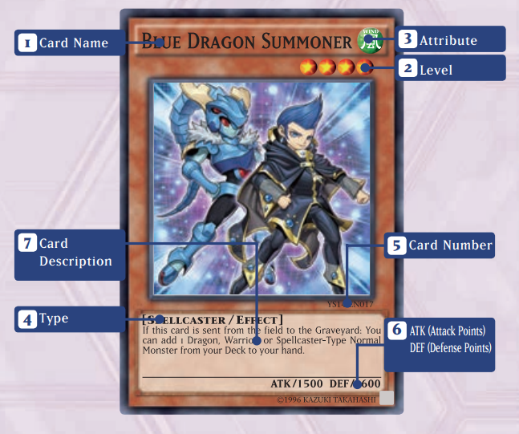
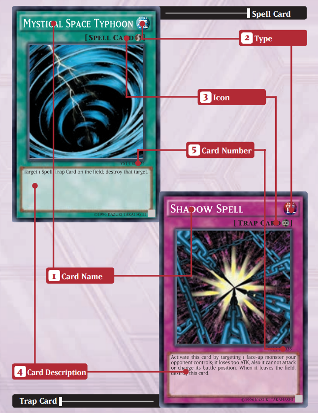

Проект по 

<b>Представяне и моделиране на знания</b>

Зимен семестър 2021/2022

*Проект тип:* А

*Изготвен от:* Иван Арабаджийски, 5MI3400052

*Специалност:* Извличане на информация и откриване на знания

*Предметна област:* **Онтология на Yu-Gi-Oh карти**

*Технологии за реализация:* Python3, Owlready2

*Анотация:* Онтология за съставяне на библиотека от Yu-Gi-Oh! карти. Какво е Yu-Gi-Oh? Бърз отговор - Trading Card Gamе, т.е. игра с карти. 
Основните класове ще описват основните видове карти - monster, spell, trap, като всяка карта има много свойства в зависимост от типа си.
Чудовищата се характеризират име, описание, 6 атрибута, тип, атака, защите, под-тип и тн., докато магиите се характеризират с изцяло други характеристика. Също като свойства можем да сложим и описания за по-лесно намиране на карти по по-общ тип ефекти (пр. бърз ефект, ефект свързан с гроба и тн. ) 
На примерните картинки виждаме само малка част от тях. 

